# 🇺🇸 การกราดยิงในสหรัฐอเมริกา: วิกฤตที่ป้องกันได้ หรือแค่ชะตากรรม?

> *"Mass shootings are a uniquely American problem."*
> — Brady United Against Gun Violence

---

## 📌 สมมติฐานหลัก (Research Hypothesis)

> ### ❓ "การกราดยิงในสหรัฐฯ ไม่ใช่ความบังเอิญ แต่เป็นผลลัพธ์ที่คาดเดาได้จากระบบที่ล้มเหลวซ้ำแล้วซ้ำเล่าใน 3 จุดเดิม: การเข้าถึงอาวุธ การตรวจสอบสุขภาพจิต และการตอบสนองของสังคม"

โปรเจกต์นี้ใช้ข้อมูลการกราดยิง **254 เหตุการณ์** ระหว่างปี 1966–2026 จาก [Mother Jones](https://www.motherjones.com/politics/2012/12/mass-shootings-mother-jones-full-data/) และ [The Violence Project](https://www.theviolenceproject.org/) เพื่อทดสอบสมมติฐานนี้ผ่าน 5 มิติ ได้แก่ แนวโน้มเวลา, ภูมิศาสตร์, โปรไฟล์ผู้ก่อเหตุ, อาวุธ และแรงจูงใจ

---

## 📈 มิติที่ 1 — แนวโน้มเวลา: วิกฤตที่เร่งตัวขึ้น

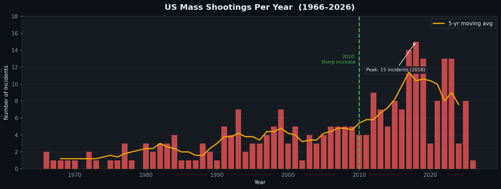

<em>Fig 1: จำนวนเหตุการณ์กราดยิงต่อปี — เส้นสีเหลืองคือค่าเฉลี่ยเคลื่อนที่ 5 ปี</em>

ก่อนปี 2010 สหรัฐฯ มีเหตุการณ์เฉลี่ย **2.7 ครั้ง/ปี** หลังปี 2010 ตัวเลขนี้พุ่งขึ้นเป็น **8.4 ครั้ง/ปี** — เพิ่มขึ้น **3.1 เท่า** ในเวลาเพียง 10 ปี

การเพิ่มขึ้นนี้ไม่ใช่ความบังเอิญ งานวิจัยของ Towers et al. (2015) ในวารสาร PLOS ONE พบว่าการกราดยิงมี **ปรากฏการณ์การแพร่ระบาด (Contagion Effect)** โดยเหตุการณ์หนึ่งจะเพิ่มความน่าจะเป็นที่จะเกิดเหตุใหม่ได้ถึง **13 วัน** หลังจากนั้น ซึ่งสอดคล้องกับการเติบโตของโซเชียลมีเดียและวัฏจักรข่าว 24 ชั่วโมงที่เปิดพื้นที่ให้ผู้ก่อเหตุได้รับความสนใจ (Johnston & Joy, 2016; APA)

> **Towers, S., et al. (2015).** Contagion in Mass Killings and School Shootings. *PLOS ONE*, 10(7). https://doi.org/10.1371/journal.pone.0117259

---

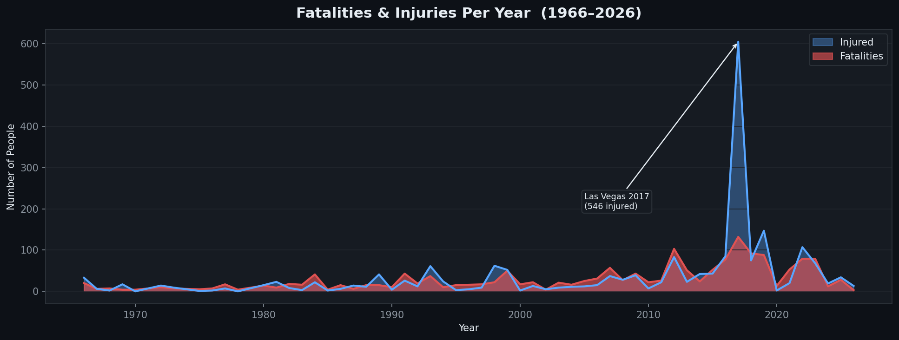

<em>Fig 2a: ผู้เสียชีวิตและบาดเจ็บรายปี — รวมเหตุการณ์ Las Vegas 2017</em>

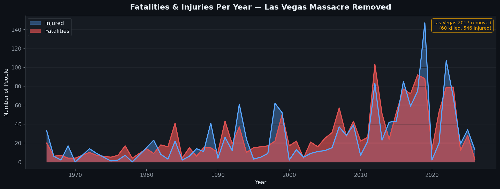

<em>Fig 2b: ผู้เสียชีวิตและบาดเจ็บรายปี — ตัด Las Vegas 2017 ออก เพื่อดูแนวโน้มที่แท้จริง</em>

เหตุการณ์ Las Vegas Strip 2017 เป็น **outlier** ทางสถิติ — มือปืนเพียงคนเดียวก่อให้เกิดผู้เสียชีวิต 60 ราย และบาดเจ็บ 546 ราย จากการยิงใส่ฝูงชน 22,000 คน หากตัดออก (Fig 2b) จะเห็นว่าแนวโน้มความรุนแรงยังคงเพิ่มขึ้นอย่างต่อเนื่อง แสดงว่า **ปี 2017 ไม่ใช่ความผิดปกติในแง่ทิศทาง แต่เป็นความผิดปกติในแง่ขนาด**

---

## 🗺️ มิติที่ 2 — ภูมิศาสตร์: ประชากรคือตัวแปรหลัก ไม่ใช่วัฒนธรรม

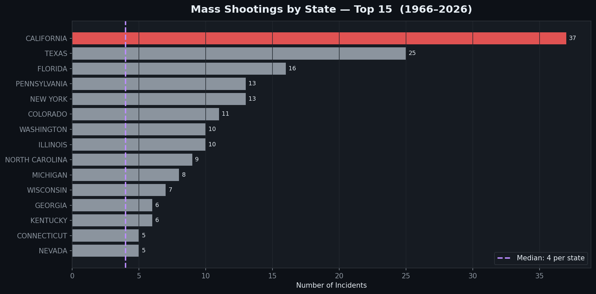

<em>Fig 3: จำนวนเหตุการณ์กราดยิงแยกตามรัฐ — เส้นประคือค่ามัธยฐาน</em>

เมื่อวิเคราะห์ความสัมพันธ์ระหว่างจำนวนเหตุการณ์กับข้อมูลเศรษฐกิจสังคมจาก US Census Bureau (2020) และ Bureau of Economic Analysis (2020):

| ตัวแปร | ความสัมพันธ์กับจำนวนเหตุการณ์ (r) | ความหมาย |
|--------|--------------------------------------|-----------|
| **ขนาดประชากร** | **r = 0.936** | แข็งแกร่งมาก |
| GDP รวมของรัฐ | r = 0.411 | ปานกลาง (เพราะ GDP สูงสัมพันธ์กับประชากรมาก) |
| GDP ต่อหัวประชากร | r = 0.079 | แทบไม่มีความสัมพันธ์ |

**ข้อค้นพบ:** รัฐที่มีเหตุการณ์สูงไม่ใช่เพราะ "วัฒนธรรมปืน" มากกว่ารัฐอื่น แต่เป็นเพราะมี **ประชากรมากกว่า** — California, Texas, Florida เป็น 3 รัฐที่มีประชากรสูงสุดในประเทศ เมื่อคำนวณ **อัตราต่อประชากร 1 ล้านคน** รัฐที่ "อันตราย" ที่สุดกลับเป็น Alaska (4.09), Colorado (1.91) และ Nevada (1.61) ไม่ใช่ California

> **US Census Bureau. (2020).** 2020 Census: State Population Totals. https://www.census.gov/data/tables/time-series/demo/popest/2020s-state-total.html
> **Bureau of Economic Analysis. (2020).** GDP by State. https://www.bea.gov/data/gdp/gdp-state

---

## 📍 มิติที่ 3 — สถานที่: วิกฤตที่เกิดในชีวิตประจำวัน

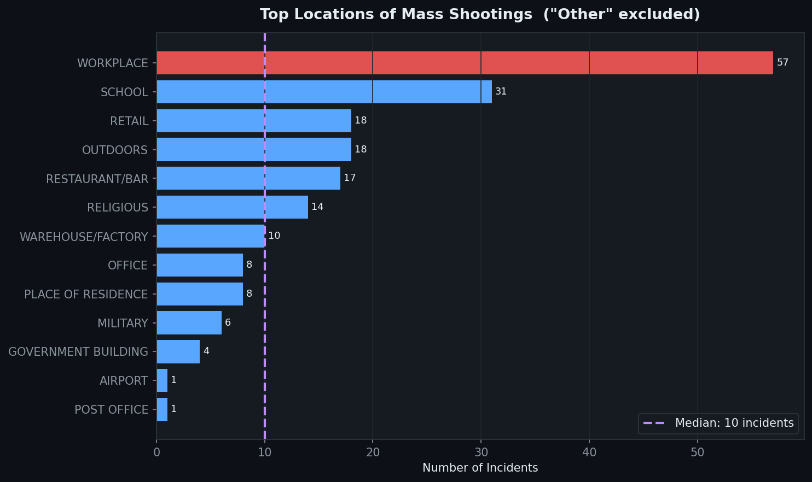

<em>Fig 4: สถานที่เกิดเหตุที่พบบ่อยที่สุด — ไม่รวมหมวด "อื่นๆ"</em>

การกราดยิงไม่ได้เกิดในที่ลับตา แต่เกิดในสถานที่ที่คนอเมริกันใช้ชีวิตทุกวัน:

| สถานที่ | เหตุการณ์ | ผู้เสียชีวิตเฉลี่ย/เหตุการณ์ |
|---------|-----------|-------------------------------|
| **สถานที่ทำงาน** | 57 | 6.0 |
| **โรงเรียน** | 31 | **9.1** |
| กลางแจ้ง | 18 | — |
| ร้านค้า | 18 | — |

จุดที่น่าสังเกตคือ แม้โรงเรียนจะมีความถี่น้อยกว่าสถานที่ทำงาน แต่มีผู้เสียชีวิตเฉลี่ย **สูงกว่า 52%** ข้อมูลจาก NIJ (National Institute of Justice, 2020) พบว่า **80% ของผู้ก่อเหตุอยู่ในสภาวะวิกฤต** ก่อนการโจมตี และ **21.6% ศึกษาการกราดยิงในอดีต** ซึ่งสอดคล้องกับปรากฏการณ์ contagion effect ที่กล่าวถึงใน Fig 1

> **National Institute of Justice. (2020).** Public Mass Shootings: Database Amasses Details of a Half Century of U.S. Mass Shootings. https://nij.ojp.gov/topics/articles/public-mass-shootings-database

---

## 🔫 มิติที่ 4 — อาวุธ: ช่องว่างของระบบที่อนุญาตให้ผ่านได้

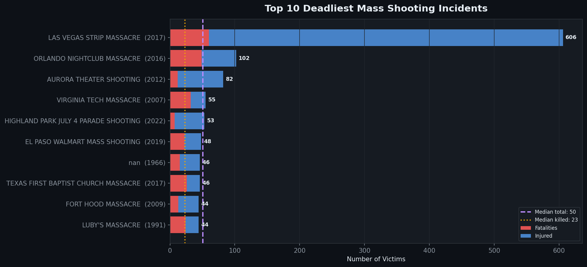

<em>Fig 5: 10 เหตุการณ์ที่มีเหยื่อสูงสุด — เส้นประแสดงค่ามัธยฐาน</em>

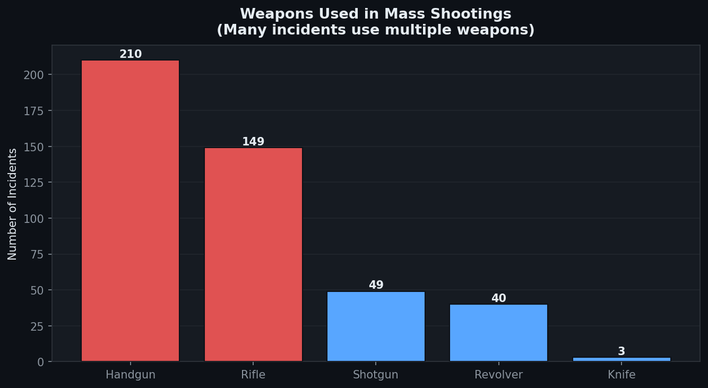

<em>Fig 6: ประเภทอาวุธที่ใช้ — ผู้ก่อเหตุส่วนใหญ่ใช้มากกว่า 1 ประเภท</em>

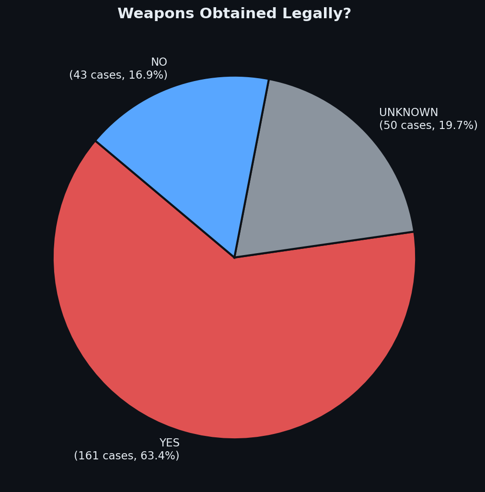

<em>Fig 7: การได้มาซึ่งอาวุธ</em>

นี่คือหนึ่งในผลที่สนับสนุนสมมติฐานหลักได้ชัดที่สุด:

- **63.4% ได้อาวุธมาอย่างถูกกฎหมาย** — หมายความว่าพวกเขาผ่านการตรวจสอบประวัติ
- เหตุการณ์ที่ใช้ **ปืนไรเฟิล** มีจำนวนเหยื่อเฉลี่ย **4 เท่า** ของเหตุการณ์ที่ใช้ปืนพกเท่านั้น
- 10 เหตุการณ์ที่มีผู้เสียชีวิตสูงสุดล้วนเกิดในพื้นที่สาธารณะขนาดใหญ่ และใช้อาวุธกึ่งอัตโนมัติ

ข้อมูลจาก NIJ (2020) พบว่า **64.5% มีประวัติอาชญากรรม** และ **4.7% เท่านั้น** ที่มีบันทึกสุขภาพจิตที่ทำให้ถูกห้ามซื้ออาวุธ — แสดงให้เห็นว่าระบบตรวจสอบประวัติไม่สามารถกรองผู้มีความเสี่ยงสูงได้ในทางปฏิบัติ

> **National Institute of Justice. (2020).** Public Mass Shootings Database. https://nij.ojp.gov/topics/articles/public-mass-shootings-database

---

## 🧠 มิติที่ 5 — ผู้ก่อเหตุและแรงจูงใจ: วิกฤตส่วนตัวที่ไม่ได้รับการแก้ไข

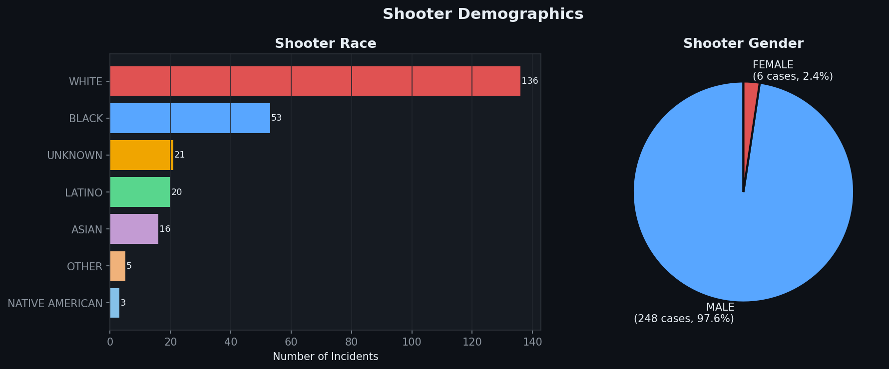

<em>Fig 8: เพศและเชื้อชาติของผู้ก่อเหตุ</em>

<em>Fig 9: การกระจายตัวของอายุผู้ก่อเหตุ — เส้นสีม่วงคือค่ามัธยฐาน (33 ปี)</em>

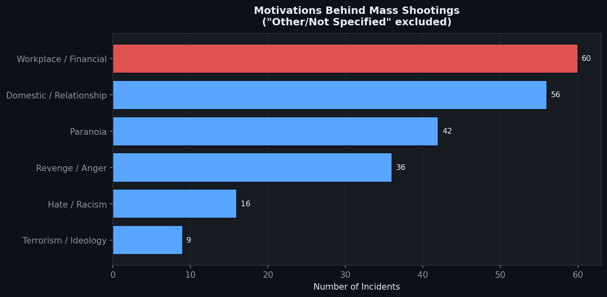

<em>Fig 10: แรงจูงใจหลัก — ไม่รวมหมวด "ไม่ระบุ"</em>

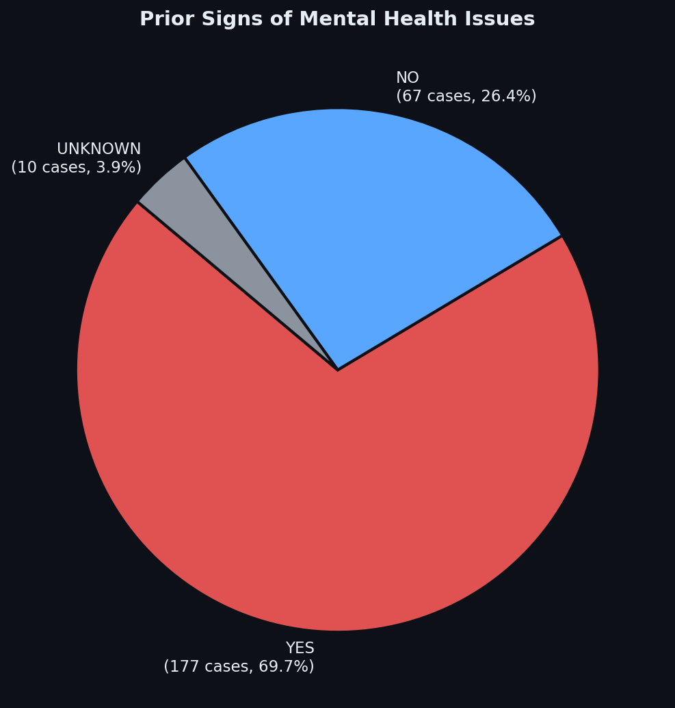

<em>Fig 11: สัดส่วนผู้ก่อเหตุที่มีสัญญาณปัญหาสุขภาพจิตก่อนเกิดเหตุ</em>

**โปรไฟล์ที่พบบ่อยที่สุด:** ชายผิวขาว อายุ ~33 ปี แรงจูงใจเกี่ยวกับที่ทำงาน/ครอบครัว และมีสัญญาณสุขภาพจิตมาก่อน

ผลที่น่าสนใจที่สุดในมิตินี้คือ **69.7% แสดงสัญญาณปัญหาสุขภาพจิตก่อนก่อเหตุ** แต่งานวิจัยของ Columbia University (Girgis et al., 2022) ชี้ให้เห็นว่า **ความเจ็บป่วยทางจิตอย่างรุนแรง (เช่น โรคจิตเภท) พบในผู้ก่อเหตุเพียง 8%** — ที่เหลือเป็นภาวะซึมเศร้า ความโกรธ และการแยกตัวจากสังคม ซึ่งเป็นสัญญาณที่สังเกตได้และแทรกแซงได้ก่อนเกิดเหตุ

> **Girgis, R.R., et al. (2022).** Columbia Mass Murder Database findings. *Columbia University Department of Psychiatry*. https://www.columbiapsychiatry.org/news/new-findings-columbia-mass-murder-database
>
> **Lankford, A., & Cowan, R.G. (2020).** Has the Role of Mental Health Problems in Mass Shootings Been Significantly Underestimated? *Journal of Threat Assessment and Management*, 7(3-4), 135–156.

---

## 🔍 สรุป: สมมติฐานได้รับการยืนยันหรือไม่?

> **สมมติฐาน:** "การกราดยิงเป็นผลลัพธ์ที่คาดเดาได้จากระบบที่ล้มเหลวซ้ำแล้วซ้ำเล่าใน 3 จุด"

Data สนับสนุนสมมติฐานนี้จาก 3 หลักฐาน:

**① ระบบการเข้าถึงอาวุธล้มเหลว**
63.4% ของผู้ก่อเหตุได้อาวุธมาถูกกฎหมาย และมีเพียง 4.7% ที่มีบันทึกที่ทำให้ถูกห้ามซื้อ (NIJ, 2020) — ระบบ background check ไม่ได้ออกแบบมาเพื่อกรองคนที่กำลังอยู่ในวิกฤตแต่ยังไม่เคยมีประวัติ

**② ระบบตรวจจับสัญญาณเตือนล้มเหลว**
69.7% มีสัญญาณที่สังเกตได้ล่วงหน้า และ 80% อยู่ในสภาวะวิกฤตก่อนก่อเหตุ (NIJ, 2020) — แต่สัญญาณเหล่านี้ไม่ได้ถูกนำไปสู่การแทรกแซง โดยเฉพาะในกลุ่มผู้เยาว์ 11 ราย ที่ทุกคนก่อเหตุในโรงเรียนที่มีการติดต่อกับพวกเขาอยู่แล้ว

**③ ระบบการตอบสนองของสังคมล้มเหลว**
อัตราเพิ่มขึ้น 3 เท่าหลังปี 2010 สอดคล้องกับปรากฏการณ์ contagion effect (Towers et al., 2015) ที่สื่อมวลชนและโซเชียลมีเดียขยายความสนใจไปสู่ผู้ก่อเหตุ ซึ่งกระตุ้นให้เกิดพฤติกรรมเลียนแบบ

**ข้อจำกัด:** ข้อมูลชุดนี้ครอบคลุมเฉพาะเหตุการณ์ที่ถูกบันทึก อาจมี selection bias โดยเหตุการณ์ขนาดใหญ่มีแนวโน้มได้รับการบันทึกมากกว่า นอกจากนี้ความสัมพันธ์ (correlation) ที่พบไม่ได้พิสูจน์ความเป็นเหตุ-ผล (causation)

---

## 💡 นัยเชิงนโยบายที่มีหลักฐานรองรับ

| ปัญหาที่พบจาก Data | มาตรการที่สอดคล้อง |
|--------------------|-------------------|
| 63.4% ได้อาวุธถูกกฎหมาย | ปฏิรูป background check ให้ครอบคลุมสุขภาพจิตและวิกฤตเฉียบพลัน |
| 69.7% มีสัญญาณล่วงหน้า | Structured Threat Assessment Protocol ในโรงเรียนและองค์กร |
| อัตราเพิ่ม 3x หลัง 2010 (contagion) | แนวทางรายงานข่าวที่ไม่เปิดเผยตัวตนผู้ก่อเหตุ |
| โรงเรียน: ผู้เสียชีวิตเฉลี่ยสูงกว่าที่ทำงาน 52% | Early intervention program สำหรับนักเรียนที่มีสัญญาณเสี่ยง |
| ปืนไรเฟิล: เหยื่อ 4x ของปืนพก | กฎหมาย Extreme Risk Protection Order (Red Flag Laws) |

---

## 📂 แหล่งข้อมูล

**ชุดข้อมูลหลัก:**
- Follman, M., et al. (2024). *US Mass Shootings Database*. Mother Jones. https://www.motherjones.com/politics/2012/12/mass-shootings-mother-jones-full-data/
- Peterson, J., & Densley, J. (2024). *The Violence Project Database*. https://www.theviolenceproject.org/databases/

**ข้อมูลประชากรและเศรษฐกิจ:**
- US Census Bureau. (2020). *2020 Census: State Population Totals*. https://www.census.gov/data/tables/time-series/demo/popest/2020s-state-total.html
- Bureau of Economic Analysis. (2020). *GDP by State*. https://www.bea.gov/data/gdp/gdp-state

**งานวิจัยอ้างอิง:**
- Towers, S., et al. (2015). Contagion in Mass Killings and School Shootings. *PLOS ONE*, 10(7). https://doi.org/10.1371/journal.pone.0117259
- Johnston, J.B., & Joy, A. (2016). Mass Shooters and the Media Contagion Effect. *American Psychological Association Annual Convention*.
- National Institute of Justice. (2020). Public Mass Shootings: Database Amasses Details of a Half Century of U.S. Mass Shootings. https://nij.ojp.gov/topics/articles/public-mass-shootings-database
- Lankford, A., & Cowan, R.G. (2020). Has the Role of Mental Health Problems in Mass Shootings Been Significantly Underestimated? *Journal of Threat Assessment and Management*, 7(3-4), 135–156.
- Girgis, R.R., et al. (2022). New Findings from the Columbia Mass Murder Database. *Columbia University Department of Psychiatry*. https://www.columbiapsychiatry.org/news/new-findings-columbia-mass-murder-database
- Brady United Against Gun Violence. (n.d.). *Statistics*. https://www.bradyunited.org/fact-sheets

---

## 🛠️ เครื่องมือที่ใช้
- **Python** (pandas, matplotlib) — วิเคราะห์ข้อมูลและสร้างกราฟ
- **GitHub** — นำเสนอผลลัพธ์
